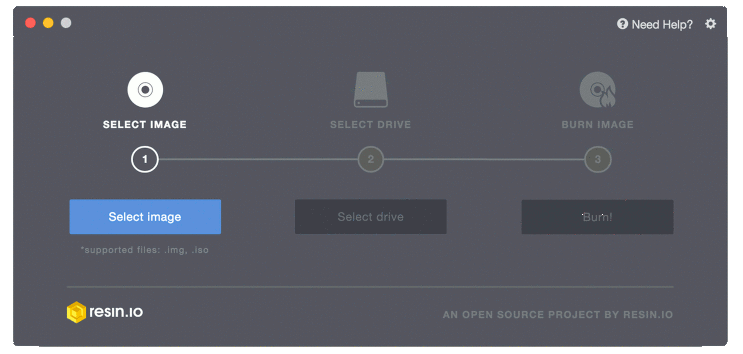
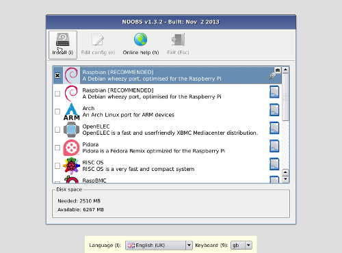

# Raspberry Pi Software Guide

So you've got a Raspberry Pi, and you've made sure you have all the [physical equipment](https://www.raspberrypi.org/learning/help-hardware-guide) you need. Now what? It's time to get yourself an Operating System and boot up your Raspberry Pi. 

## Geting an Operating System

The recommended Operating System for use with the Raspberry Pi is called Raspbian. Raspbian is a version of GNU/Linux, designed specifically to work well with the Raspberry Pi. You have several options when it comes to getting hold of a copy of Raspbian.

### Buy a pre-installed SD card

The easiest way to get NOOBS or Raspbian is to buy an SD card with the software already installed. You can get a pre-installed Raspbian card from [RS](http://uk.rs-online.com/web/c/computing-peripherals/data-storage-memory/secure-digital-cards/?searchTerm=noobs) or [The Pi Hut](https://thepihut.com/products/raspbian-preinstalled-sd-card)

### Install Raspbian with NOOBS

NOOBS stands for **N**ew **O**ut **O**f **B**ox **S**oftware, and if you've never before played around with GNU/Linux, then it's the best place to start. To begin with, it's always a good idea to make sure you have formatted you SD Card. You'll need to make sure your computer has a built-in SD card reader, or you can use a USB SD Card reader.

1. Visit the [SD Association’s website](http://www.sdcard.org/) and download [SD Formatter 4.0](https://www.sdcard.org/downloads/formatter_4/index.html) for either Windows or Mac.
1. Follow the instructions to install the software.
1. Insert your SD card into the computer or laptop’s SD card reader and make a note of the drive letter allocated to it, e.g. `F:/`.
1. In SD Formatter, select the drive letter for your SD card and format it.

#### Download NOOBS files then drag and drop

1. Visit the official Raspberry Pi [Downloads page](http://www.raspberrypi.org/downloads/).

  

1. Click on **NOOBS**.

  

1. Click on the **Download ZIP** button under ‘NOOBS (offline and network install)’, and select a folder to save it to.
1. Extract the files from the zip.
1. Once your SD card has been formatted, drag all the files in the extracted NOOBS folder and drop them onto the SD card drive.
1. The necessary files will then be transferred to your SD card.
1. When this process has finished, safely remove the SD card and insert it into your Raspberry Pi.

<iframe src="https://player.vimeo.com/video/90518800" width="500" height="281" frameborder="0" webkitallowfullscreen mozallowfullscreen allowfullscreen></iframe>

### Download and image Raspbian directly

An alternative to using NOOBS to install Raspbian is to download and install the image directly. This is a faster process, and is great if you need to image multiple cards for a workshop or class.

1. Using a computer with an SD card reader, visit the official Raspberry Pi [Downloads page](http://www.raspberrypi.org/downloads/).
1. Click on **Raspbian**.

  

1. Click on the **Download ZIP** button under ‘Raspbian Jessie (full desktop image)’, and select a folder to save it to.
1. Extract the files from the zip.

  

1. Visit [etcher.io](http://www.etcher.io/) and download and install the Etcher SD card image utility.
1. Run Etcher and select the Raspbian image you unzipped on your computer or laptop.
1. Then select the SD card drive. Note that the software may have already selected the right drive.
1. Finally, click **Burn** to transfer Raspbian to the SD card. You will see a progress bar that tells you how much is left to do. Once complete, the utility will automatically eject/unmount the SD card so it's safe to remove it from the computer.

  

## First Boot
Now that you have an operating system, you can slot your SD card into your Raspberry Pi and connect the power. Follow the [hardware help section](https://www.raspberrypi.org/learning/help-hardware-guide) if you need assistance with this.

1. If this is the first time your Raspberry Pi and SD card have been used, then you will have to select an operating system and configure it.

<iframe src="https://player.vimeo.com/video/91631396" width="500" height="281" frameborder="0" webkitallowfullscreen mozallowfullscreen allowfullscreen></iframe>

## The first time you power on

1. Once you have plugged in the power cable to your Raspberry Pi, it will boot. If you are using NOOBS, a window will appear with a list of different operating systems that you can install. We recommend that you use Raspbian: tick the box next to Raspbian and click on **Install**.

  

1. Raspbian will then run through its installation process. Please note that this can take a while.
1. When the install process has completed, the Raspberry Pi configuration menu (`raspi-config`) will load. Here you are able to set the time and date for your region, enable a Raspberry Pi camera board, or even create users. You can exit this menu by using **Tab** on your keyboard to move to **Finish**.
1. If you downloaded Raspbian and imaged it using Etcher rather than using NOOBS, then you will boot directly to the desktop environment of Raspbian and won't need to wait.

## What next?

- Learn how to [update your SD card](update-sd-card.md)
- Connect your Raspberry Pi to [WiFi](wifi.md)
- Install more [applications](install-apps.md)
- Discover how to [back up your SD card](backup.md)

