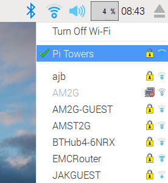

# Guide to connecting to WiFi

If you want to connect your Raspberry Pi to the internet or local network then you will need to follow these steps:

## Connecting to WiFi

1. WiFi connections can be made via the network icon at the right-hand end of the menu bar. If you are using a Raspberry Pi 3, or an earlier model with a WiFi dongle plugged in, left-clicking this icon will bring up a list of available WiFi networks.
1. If no networks are found, it will show the message `"No APs found - scanning..."`: just wait a few seconds without closing the menu, and it should find your network.
1. The icons on the right show whether a network is secured or not, and its signal strength. Click the network that you want to connect to. If it's secured, a dialogue box will appear prompting you to enter the network key.
1. Enter the key and press **OK**, then wait a couple of seconds. The network icon will flash briefly to show that a connection is being made. Once it's ready, the icon stops flashing and shows the signal strength.

  

## What next?

- Return to the [Raspberry Pi Software Guide](worksheet.md)
- Learn how to [update your SD card](update-sd-card.md)
- Install more [applications](install-apps.md)
